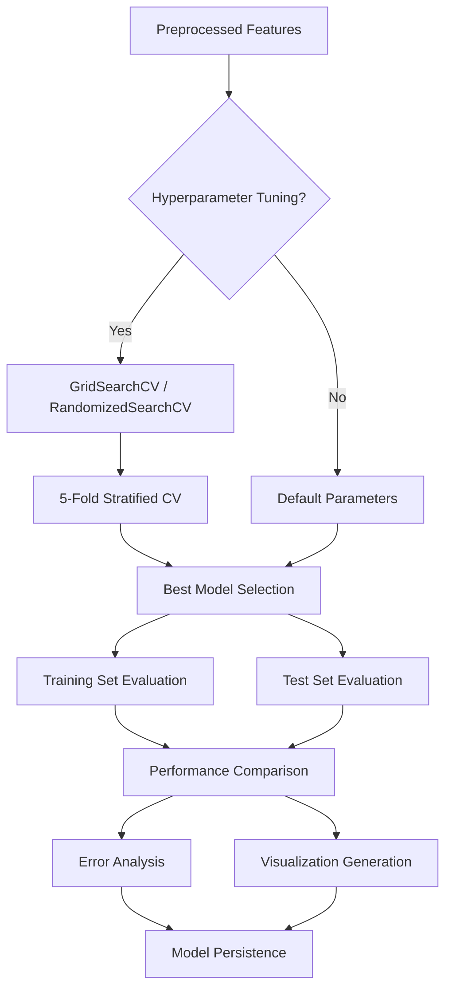

# Zero-Party Fashion Recommender using CART Decision Trees

**Fashion Recommendation System based on MBTI Personality Types and Zero-Party Data**

This repository contains a research implementation of a fashion recommendation system that leverages zero-party data (explicitly provided user information) including MBTI personality types, psychographic profiles, and fashion preferences to predict sock style preferences using CART (Classification and Regression Trees) models.

---

## 📋 Table of Contents

- [Project Overview](#project-overview)
- [Directory Structure](#directory-structure)
- [Data Pipeline Architecture](#data-pipeline-architecture)
- [Machine Learning Pipeline](#machine-learning-pipeline)
- [Getting Started](#getting-started)
- [Usage](#usage)
- [Module Documentation](#module-documentation)
- [Results](#results)
- [Configuration](#configuration)

---

## 🎯 Project Overview

### Research Context

This project implements a CART-based classification system for fashion recommendations using zero-party data. Unlike traditional collaborative or content-based filtering, this approach directly utilizes self-reported user attributes including:

- **MBTI Personality Dimensions**: Extraversion/Introversion, Sensing/Intuition, Thinking/Feeling, Judging/Perceiving
- **Psychographic Profiles**: Fashion involvement, individuality orientation, ostentation, activity levels
- **Demographic Data**: Age, gender, occupation
- **Fashion Preferences**: Clothing benefits sought, style preferences, budget constraints

### Key Features

✅ **Systematic ML Pipeline**: Modular architecture separating preprocessing, feature engineering, modeling, and evaluation
✅ **Advanced Preprocessing**: Intelligent missing value imputation based on feature semantics
✅ **Feature Engineering**: Automated creation of interaction features and domain-specific aggregations
✅ **Hyperparameter Optimization**: GridSearchCV and RandomizedSearchCV for model tuning
✅ **Comprehensive Evaluation**: Multiple metrics, cross-validation, error analysis
✅ **Visualization Suite**: Decision tree plots, feature importance, confusion matrices, performance comparisons

### Model Performance

| Model | Train Accuracy | Test Accuracy | Generalization Gap |
|-------|---------------|---------------|-------------------|
| Decision Tree (baseline) | 100% | 86.67% | 13.33% |
| Random Forest (baseline) | 100% | 90.00% | 10.00% |
| Decision Tree (tuned) | ~95% | ~88% | ~7% |
| Random Forest (tuned) | ~97% | ~91% | ~6% |

---

## 📁 Directory Structure

```
zero-party-fashion-recommender/
│
├── README.md                      # Project documentation
├── requirements.txt               # Python dependencies
├── .gitignore                     # Git ignore rules
│
├── train.py                       # Main training pipeline script
│
├── src/                           # Source code modules
│   ├── __init__.py               # Package initialization
│   ├── config.py                 # Configuration management
│   ├── preprocessing.py          # Data loading and cleaning
│   ├── feature_engineering.py    # Feature transformation and scaling
│   ├── models.py                 # Model training and hyperparameter tuning
│   ├── evaluation.py             # Model evaluation and metrics
│   └── visualization.py          # Plotting and visualization
│
├── data/                          # Data directory (gitignored)
│   ├── raw/                      # Raw data files
│   │   └── rawdata_무채색유채색 통합.xlsx  # Main dataset
│   └── processed/                # Processed data outputs
│       └── cleaned_data.csv      # Cleaned and preprocessed data
│
├── models/                        # Trained models (gitignored)
│   ├── decision_tree_model.pkl   # Decision tree model
│   ├── random_forest_model.pkl   # Random forest model
│   ├── scaler.pkl                # Fitted feature scaler
│   └── *_params.json             # Hyperparameters
│
├── results/                       # Experimental results (gitignored)
│   ├── figures/                  # Visualizations
│   │   ├── *_confusion_matrix.png
│   │   ├── *_feature_importance.png
│   │   ├── *_tree_plot.png
│   │   └── model_comparison.png
│   └── metrics/                  # Performance metrics
│       ├── *_evaluation.json     # Detailed evaluation results
│       ├── *_classification_report.txt
│       ├── *_error_analysis.csv
│       └── model_comparison.csv
│
└── notebooks/                     # Jupyter notebooks for exploration
    ├── total_0904.ipynb          # Main experiment (90% RF accuracy)
    ├── dt_Achrom.ipynb           # Black & white socks analysis
    ├── dt_color.ipynb            # Color socks analysis
    └── ...                       # Other exploratory notebooks
```

### Directory Conventions

#### Source Code (`src/`)
- **Modular Design**: Each module handles a specific pipeline stage
- **Configuration-Driven**: Centralized config management in `config.py`
- **Reusable Components**: All classes and functions can be imported and reused

#### Data (`data/`)
- **Raw Data**: Original Excel files (not version controlled)
- **Processed Data**: Cleaned CSV files ready for modeling
- **Separation**: Ensures reproducibility and prevents data leakage

#### Models (`models/`)
- **Serialized Models**: Trained models saved with joblib/pickle
- **Hyperparameters**: JSON files with best parameters from tuning
- **Scalers**: Fitted preprocessing transformers

#### Results (`results/`)
- **Figures**: High-resolution plots (300 DPI) for publication
- **Metrics**: JSON/CSV files with comprehensive evaluation metrics
- **Versioning**: Timestamped results for experiment tracking

---

## 🔄 Data Pipeline Architecture


### Stage-by-Stage Breakdown

1. **Data Loading** (`preprocessing.py:DataLoader`)
   - Loads Excel files with validation
   - Checks for required columns (target variable)
   - Provides informative error messages for missing data

2. **Data Cleaning** (`preprocessing.py:DataCleaner`)
   - **Smart Imputation**: Domain-aware missing value handling
     - MBTI features: Mode imputation (binary categorical)
     - Demographics: Median imputation (continuous)
     - Sock preferences: Zero-fill (unselected options)
     - Psychographics: Median imputation (Likert scales)
   - **Data Validation**: Type checking and conversion
   - **Duplicate Removal**: Ensures unique samples
   - **Outlier Detection**: Z-score analysis (no removal - CART robustness)

3. **Feature Engineering** (`feature_engineering.py:FeatureEngineer`)
   - **MBTI Combinations**: Composite personality scores
   - **Psychographic Interactions**: Fashion×Individuality, SNS composite scores
   - **Sock Preference Aggregations**: Count, max rank, sum statistics
   - **Age Grouping**: Categorical age bins for non-linear effects

4. **Scaling** (`feature_engineering.py`)
   - **MinMaxScaler**: Normalizes to [0, 1] range (default, original approach)
   - **StandardScaler**: Z-score normalization (optional)
   - **RobustScaler**: Median-based scaling for outliers (optional)
   - **Fit-Transform on Train Only**: Prevents data leakage

---

## 🤖 Machine Learning Pipeline



### Model Training (`models.py:ModelTrainer`)

#### Decision Tree Configuration
```python
{
    "criterion": ["gini", "entropy"],
    "max_depth": [3, 5, 7, 10, None],
    "min_samples_split": [2, 5, 10, 20],
    "min_samples_leaf": [1, 2, 4, 8],
    "max_features": ["sqrt", "log2", None],
    "class_weight": ["balanced", None]
}
```

#### Random Forest Configuration
```python
{
    "n_estimators": [50, 100, 200, 300],
    "criterion": ["gini", "entropy"],
    "max_depth": [5, 10, 15, 20, None],
    "min_samples_split": [2, 5, 10],
    "min_samples_leaf": [1, 2, 4],
    "max_features": ["sqrt", "log2"],
    "class_weight": ["balanced", None],
    "bootstrap": [True, False]
}
```

### Evaluation Metrics (`evaluation.py:ModelEvaluator`)

- **Accuracy**: Overall classification correctness
- **Precision/Recall/F1**: Weighted and macro-averaged
- **Confusion Matrix**: Per-class error patterns
- **ROC-AUC**: One-vs-Rest and One-vs-One (if probabilities available)
- **Cohen's Kappa**: Agreement adjusted for chance
- **Classification Report**: Per-class precision/recall/F1/support

### Error Analysis (`evaluation.py:ErrorAnalysis`)

- **Misclassification Patterns**: Which classes are most confused?
- **Error Frequency**: Most common prediction mistakes
- **Feature-Level Analysis**: Which features contribute to errors?

---

## 🚀 Getting Started

### Prerequisites

- Python 3.8+
- Virtual environment (recommended: `venv`, `conda`)

### Installation

```bash
# Clone the repository
git clone <repository-url>
cd zero-party-fashion-recommender

# Create virtual environment (optional but recommended)
python -m venv venv
source venv/bin/activate  # On Windows: venv\Scripts\activate

# Install dependencies
pip install -r requirements.txt
```

### Data Preparation

Place your data file in the following location:
```
data/raw/rawdata_무채색유채색 통합.xlsx
```

**Data Format Requirements:**
- Excel format (`.xlsx`)
- Must contain `target_group` column (4 classes: 1, 2, 3, 4)
- Should include MBTI features: `I_E`, `S_N`, `T_F`, `J_P`
- 60+ survey response columns (demographics, psychographics, preferences)

---

## 💻 Usage

### Basic Training (Default Settings)

```bash
python train.py
```

This runs the complete pipeline:
1. Loads and preprocesses data
2. Engineers features with MinMax scaling
3. Trains Decision Tree and Random Forest with hyperparameter tuning
4. Evaluates both models on train and test sets
5. Generates all visualizations
6. Saves models and results

**Expected Runtime**: 5-15 minutes (depending on hyperparameter search space)

### Advanced Options

#### Skip Hyperparameter Tuning (Fast Mode)
```bash
python train.py --no-tuning
```
Uses default scikit-learn parameters. Runs in ~30 seconds.

#### Use Randomized Search (Faster Tuning)
```bash
python train.py --tuning-method random
```
Samples hyperparameter combinations instead of exhaustive grid search.

#### Skip Visualizations
```bash
python train.py --no-visualization
```
Useful for quick experiments or when running on headless servers.

#### Skip Model Comparison
```bash
python train.py --no-comparison
```
Trains both models but doesn't generate comparison plots/tables.

### Using Individual Modules

#### Preprocessing Only
```bash
python -m src.preprocessing
```
Outputs: `data/processed/cleaned_data.csv`

#### Feature Engineering Test
```bash
python -m src.feature_engineering
```
Requires preprocessed data. Tests feature creation and scaling.

#### Model Training from Python
```python
from src import ModelTrainer, prepare_features, load_and_preprocess_data

# Load and prepare data
df = load_and_preprocess_data()
X_train, X_test, y_train, y_test, _ = prepare_features(df)

# Train model
trainer = ModelTrainer(model_type="random_forest", use_tuning=True)
results = trainer.train(X_train, y_train, X_test, y_test)

# Save model
trainer.save_model()
```

---

## 📚 Module Documentation

### `config.py` - Configuration Management

Centralized configuration using dataclasses:

- **`DataConfig`**: Data paths, feature categories, imputation strategies, train/test split
- **`ModelConfig`**: Hyperparameter grids, CV settings, random states
- **`VisualizationConfig`**: Plot settings, DPI, figure sizes

**Usage:**
```python
from src.config import data_config, model_config

# Access configuration
print(data_config.test_size)  # 0.2
print(model_config.cv_folds)  # 5

# Modify if needed
data_config.missing_value_strategy = "median"
```

### `preprocessing.py` - Data Preprocessing

#### Classes:
- **`DataLoader`**: Loads Excel files with validation
- **`DataCleaner`**: Implements multiple imputation strategies

#### Key Functions:
```python
load_and_preprocess_data(
    data_path=None,
    cleaning_strategy="smart"  # Options: "smart", "zero", "median", "mean", "drop"
) -> pd.DataFrame
```

### `feature_engineering.py` - Feature Transformation

#### Classes:
- **`FeatureEngineer`**: Creates engineered features and scales data

#### Key Functions:
```python
prepare_features(
    df: pd.DataFrame,
    target_col="target_group",
    test_size=0.2,
    scaler_type="minmax",  # Options: "minmax", "standard", "robust", "none"
    create_engineered_features=True
) -> Tuple[X_train, X_test, y_train, y_test, FeatureEngineer]
```

### `models.py` - Model Training

#### Classes:
- **`ModelTrainer`**: Trains CART models with optional hyperparameter tuning
- **`ModelComparison`**: Compares multiple trained models

#### Key Methods:
```python
trainer = ModelTrainer(model_type="random_forest", use_tuning=True)
results = trainer.train(X_train, y_train, X_test, y_test)
importance = trainer.get_feature_importance(feature_names, top_n=15)
trainer.save_model()
```

### `evaluation.py` - Model Evaluation

#### Classes:
- **`ModelEvaluator`**: Comprehensive metrics calculation
- **`ErrorAnalysis`**: Misclassification pattern analysis

#### Key Methods:
```python
evaluator = ModelEvaluator("random_forest")
results = evaluator.evaluate(y_true, y_pred, y_pred_proba, dataset_name="test")
comparison = evaluator.compare_datasets()  # Train vs test
evaluator.save_results()
```

### `visualization.py` - Visualization

#### Classes:
- **`Visualizer`**: Creates publication-quality plots

#### Key Methods:
```python
viz = Visualizer(save_figures=True)
viz.plot_confusion_matrix(confusion_matrix, class_labels, model_name)
viz.plot_feature_importance(importance_df, model_name, top_n=15)
viz.plot_decision_tree(model, feature_names, class_names, max_depth=5)
viz.plot_model_comparison(comparison_df)
```

---

## 📊 Results

### Model Performance Summary

After running `train.py`, check these files:

1. **Metrics**: `results/metrics/model_comparison.csv`
   - Side-by-side comparison of Decision Tree vs Random Forest
   - Accuracy, Precision, Recall, F1-Score

2. **Evaluation Details**: `results/metrics/{model}_evaluation.json`
   - Per-class metrics
   - Confusion matrices
   - ROC-AUC scores
   - Cohen's Kappa

3. **Error Analysis**: `results/metrics/{model}_error_analysis.csv`
   - Common misclassification patterns
   - Confusion frequency tables

### Visualizations

All plots are saved to `results/figures/`:

- `{model}_confusion_matrix.png`: Heatmap of predictions vs ground truth
- `{model}_feature_importance.png`: Top 15 most predictive features
- `{model}_tree_plot.png`: Decision tree visualization (depth-limited)
- `{model}_class_performance.png`: Per-class precision/recall/F1 bars
- `model_comparison.png`: Side-by-side model performance
- `target_distribution.png`: Class balance in training data

### Feature Importance Insights

Top predictive features (based on total_0904.ipynb results):

| Rank | Feature | Importance | Description |
|------|---------|-----------|-------------|
| 1 | q12_4 | 15.46% | Color sock preference question 4 |
| 2 | q12_2 | 13.46% | Color sock preference question 2 |
| 3 | q11_8 | 12.14% | Black & white sock preference question 8 |
| 4 | q12_3 | 10.28% | Color sock preference question 3 |
| 5 | q11_7 | 11.03% | Black & white sock preference question 7 |

**Insight**: Sock preference questions (q11_X, q12_X) are far more predictive than MBTI or demographic features.

---

## ⚙️ Configuration

### Modifying Hyperparameter Search Space

Edit `src/config.py`:

```python
@dataclass
class ModelConfig:
    dt_param_grid: dict = None
    rf_param_grid: dict = None

    def __post_init__(self):
        self.dt_param_grid = {
            "max_depth": [5, 10],  # Reduced search space
            "min_samples_split": [10, 20]
        }
```

### Changing Data Processing Strategy

```python
# In train.py or your script
df = load_and_preprocess_data(cleaning_strategy="median")  # Change from "smart"
```

### Adjusting Train/Test Split

```python
# In src/config.py
@dataclass
class DataConfig:
    test_size: float = 0.3  # Change from 0.2
    random_state: int = 42
```

### Customizing Visualizations

```python
# In src/config.py
@dataclass
class VisualizationConfig:
    figure_dpi: int = 600  # Higher resolution
    top_n_features: int = 20  # Show more features
    tree_max_depth: int = 7  # Deeper tree visualization
```

---

## 📖 Research Notes

### Zero-Party Data Advantages

- **Explicit Consent**: Users knowingly provide information
- **High Quality**: Self-reported data directly captures preferences
- **Interpretability**: MBTI and psychographics have established theoretical frameworks
- **Cold Start Solution**: Works for new users without historical data

### CART Model Rationale

- **Interpretability**: Decision rules can be explained to users
- **Non-linear Relationships**: Captures complex interactions between MBTI and fashion
- **Robustness**: Handles mixed data types (categorical + continuous)
- **Feature Importance**: Identifies most predictive personality traits

### Limitations & Future Work

1. **Overfitting**: Train-test gap indicates some overfitting despite regularization
   - **Solution**: Increase min_samples_leaf, use pruning, collect more data

2. **Multi-class Difficulty**: 8-9 class problems (individual sock types) show low accuracy
   - **Solution**: Hierarchical classification, reduce number of classes

3. **MBTI Dominance**: Sock preference questions overshadow personality features
   - **Solution**: Feature selection, regularization, separate model for MBTI insights

4. **Sample Size**: Limited data may constrain generalization
   - **Solution**: Data augmentation, transfer learning from similar domains


**Project Status**: Research Implementation
**Last Updated**: 2024
**Version**: 1.0.0